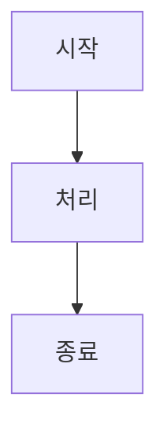

# Sprint {N} 구현 문서

> **기간**: Week {N}
> **목표**: {Sprint Goal}
> **완료일**: YYYY-MM-DD

---

## 1. 개요

### 1.1 스프린트 목표
- {주요 목표 1}
- {주요 목표 2}
- ...

### 1.2 완료된 User Stories
- US-XXX: {User Story 제목} ✅
- US-YYY: {User Story 제목} ✅
- ...

### 1.3 완료된 Test Cases
- TC-XXXX: {Test Case 제목} ✅
- TC-YYYY: {Test Case 제목} ✅
- ...

---

## 2. 컴포넌트별 구현 사항

### 2.1 Supabase / Infra

#### 2.1.1 마이그레이션 파일
- **파일**: `supabase/migrations/XXX_create_XXX.sql`
- **목적**: {마이그레이션 목적}
- **주요 내용**:
  - {테이블/기능 1}
  - {테이블/기능 2}
  - ...
- **구현 로직** (한글):
  ```
  {상세 설명}
  - 테이블 설계 시 고려사항
  - 제약조건 및 인덱스 설정 이유
  - RLS 정책 설정 근거
  ```

#### 2.1.2 환경 변수 설정
- `ENV_VAR_1`: {설명}
- `ENV_VAR_2`: {설명}

---

### 2.2 Web (Next.js)

#### 2.2.1 {기능명}
- **파일**: `web/src/app/{경로}/page.tsx`
- **목적**: {페이지/컴포넌트 목적}
- **주요 기능**:
  - {기능 1}
  - {기능 2}
  - ...
- **구현 로직** (한글):
  ```
  {상세 설명}
  - 상태 관리 방식
  - API 호출 패턴
  - 에러 핸들링
  - 사용자 경험 고려사항
  ```
- **관련 파일**:
  - `web/src/lib/{파일명}` — {설명}
  - `web/src/components/{파일명}` — {설명}

#### 2.2.2 Server Actions
- **파일**: `web/src/app/{경로}/actions.ts`
- **목적**: {Server Action 목적}
- **구현 로직** (한글):
  ```
  {상세 설명}
  - 입력 검증 방식
  - Supabase 연동 로직
  - 에러 처리 및 응답 형식
  ```

---

### 2.3 Worker (Go)

#### 2.3.1 {모듈명}
- **파일**: `worker/internal/{패키지}/{파일명}.go`
- **목적**: {모듈 목적}
- **주요 함수/타입**:
  - `FunctionName(params) (result, error)` — {설명}
  - `TypeName struct` — {설명}
- **구현 로직** (한글):
  ```
  {상세 설명}
  - 알고리즘 선택 이유
  - 에러 처리 전략
  - 동시성 고려사항 (goroutine 사용 시)
  - 외부 라이브러리 선택 근거
  ```
- **테스트**:
  - TC-XXXX: {테스트 설명} ✅
  - TC-YYYY: {테스트 설명} ✅

---

## 3. 주요 아키텍처 결정

### 3.1 {결정 사항 1}
- **결정**: {무엇을 결정했는지}
- **이유**:
  - {이유 1}
  - {이유 2}
- **대안 고려**:
  - {대안 1}: {제외 이유}
  - {대안 2}: {제외 이유}
- **트레이드오프**:
  - 장점: {장점}
  - 단점: {단점}

### 3.2 {결정 사항 2}
- **결정**: {무엇을 결정했는지}
- **이유**: {상세 설명}

---

## 4. 테스트 결과

### 4.1 Unit Tests
| Test Case | Status | Notes |
|-----------|--------|-------|
| TC-XXXX | ✅ Pass | {추가 설명} |
| TC-YYYY | ✅ Pass | {추가 설명} |
| TC-ZZZZ | ❌ Fail | {실패 이유 및 해결 방법} |

**총 {N}개 / Pass {M}개 / Fail {K}개 / Coverage: {X}%**

### 4.2 Integration Tests
| Test Case | Status | Notes |
|-----------|--------|-------|
| TC-XXXX | ✅ Pass | {추가 설명} |
| TC-YYYY | ✅ Pass | {추가 설명} |

**총 {N}개 / Pass {M}개 / Fail {K}개**

### 4.3 E2E Tests
| Test Case | Status | Notes |
|-----------|--------|-------|
| TC-XXXX | ✅ Pass | {추가 설명} |
| TC-YYYY | ✅ Pass | {추가 설명} |

**총 {N}개 / Pass {M}개 / Fail {K}개**

### 4.4 Security Tests
| Test Case | Status | Notes |
|-----------|--------|-------|
| TC-XXXX | ✅ Pass | {추가 설명} |
| TC-YYYY | ✅ Pass | {추가 설명} |

**총 {N}개 / Pass {M}개 / Fail {K}개**

---

## 5. 남은 이슈 및 기술 부채

### 5.1 알려진 이슈
- [ ] **이슈 1**: {설명}
  - 영향: {영향도}
  - 해결 계획: {언제, 어떻게}
- [ ] **이슈 2**: {설명}

### 5.2 기술 부채
- [ ] **부채 1**: {설명}
  - 발생 원인: {원인}
  - 우선순위: High/Medium/Low
  - 해결 계획: {계획}
- [ ] **부채 2**: {설명}

### 5.3 다음 스프린트 개선 사항
- {개선 사항 1}
- {개선 사항 2}

---

## 6. 스프린트 회고

### 6.1 잘된 점
- {잘된 점 1}
- {잘된 점 2}
- {잘된 점 3}

### 6.2 개선이 필요한 점
- {개선점 1}
- {개선점 2}

### 6.3 배운 점
- {배운 점 1}
- {배운 점 2}

---

## 7. 다음 스프린트 준비

### 7.1 Sprint {N+1} 선행 작업
- [ ] {선행 작업 1}
- [ ] {선행 작업 2}

### 7.2 의존성 확인
- {의존성 1}: {상태}
- {의존성 2}: {상태}

### 7.3 필요한 리소스
- {리소스 1}
- {리소스 2}

---

## 부록

### A. 주요 코드 스니펫

**{기능명}**:
```go
// {한글 설명}
func ExampleFunction(param string) (string, error) {
    // 구현
}
```

**{기능명 2}**:
```typescript
// {한글 설명}
async function exampleFunction(param: string): Promise<string> {
    // 구현
}
```

### B. 다이어그램

**{다이어그램 제목}**:


### C. 참고 자료
- {참고 자료 1}
- {참고 자료 2}
